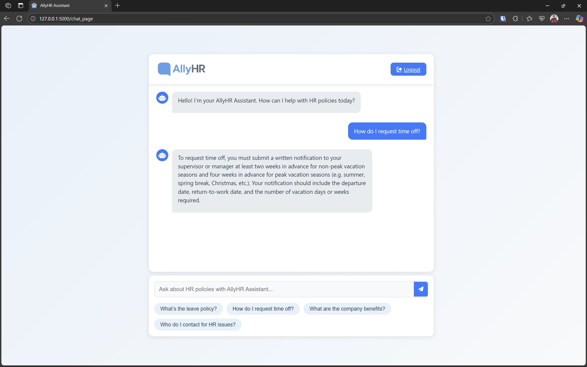

[](https://opensource.org/licenses/MIT)

# AllyHR Assistant




Welcome to the **AllyHR Assistant**, a fully local AI-powered solution for answering HR queries using natural language processing. Built with Flask, Ollama, ChromaDB, and PostgreSQL, this chatbot offers a seamless experience with streaming responses and a responsive UI, all while running entirely on your local network (except for SMTP for password resets).

## ✨ Features

  - **Fully Local Deployment (Except SMTP)**: Runs entirely on your company LAN with no internet dependency, except for SMTP-based password resets.
  - **Natural Language Understanding**: Ask questions like "What’s the leave policy?" in natural language.
  - **Ollama Integration**: Leverages Ollama for powerful AI model support.
  - **Streaming Responses**: Real-time text rendering for a dynamic chat experience.
  - **Secure Authentication**: PostgreSQL-based login with password reset functionality.
  - **Knowledge Base**: Powered by an employee handbook stored in ChromaDB.
  - **Responsive Design**: Clean UI with typing indicators and suggestion chips.

## 🛠 Tech Stack

  - **Frontend**: HTML, CSS, JavaScript
  - **Backend**: Flask (Python)
  - **AI Models**: Ollama
  - **Database**: PostgreSQL (auth), ChromaDB (knowledge base)
  - **Libraries**: Marked.js, Font Awesome

## 🚀 Getting Started

### Prerequisites

  - Python 3.8+
  - PostgreSQL 13+
  - Ollama (installed manually)
  - Git

### Installation
1. Clone the repository:
   ```bash
   git clone https://github.com/your-username/HRMS-Chatbot.git
   cd HRMS-Chatbot
   ```
2. Set up a virtual environment and install dependencies:
   ```bash
   python -m venv venv
   source venv/bin/activate  # On Windows: venv\Scripts\activate
   pip install -r requirements.txt
   ```
3. Install and run Ollama:
   - Download and install Ollama from [ollama.ai](https://ollama.ai).
   - Pull a model (e.g., `ollama pull llama3`).
4. Configure PostgreSQL:
   - Create a database: `createdb hrms_chatbot`
   - Update environment variables (create a `.env` file based on `.env.example`).
5. Populate the knowledge base:
   ```bash
   python src/backend/scripts/populate_database.py
   ```
6. Run the Flask backend:
   ```bash
   python src/backend/scripts/app.py
   ```
7. Access the chatbot at `http://localhost:5000`.

### Usage

  - Log in with credentials or register a new user.
  - Ask HR questions or use suggestion chips.
  - Reset your password via the "Reset Password" link (requires SMTP setup for email).

## 📚 Documentation

  - [Setup Guide](docs/setup.md): Step-by-step installation.
  - [API Documentation](docs/api.md): Endpoint details.
  - [Contributing](docs/contributing.md): How to contribute.

## 🤝 Contributing

We love contributions\! Check out [Contributing Guide](docs/contributing.md) for details on submitting issues, pull requests, and setting up your environment.

## 📜 License

This project is licensed under the [MIT License](LICENSE).

## 🌟 Acknowledgments

  - Thanks to the open-source community for tools like Flask, Ollama, and ChromaDB.

-----

⭐ **Star this repo** if you find it helpful\! 🚀 Open an issue or PR to collaborate\!
